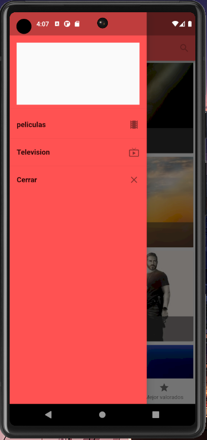

# DMI_PRACTICA9_200749

  
# Universidad Tecnológica de Xicotepec de Juárez

## Ingeniería en Desarrollo y Gestión de Software

## Desarrollo Movil Integral

## Marco Antonio Rosas Gonzalez
 
## 10° "A"

## Septiempre - Diciembre

## Descripción: Este código contiene dos clases de widgets personalizados diseñados para su uso en aplicaciones Flutter. Las clases, MediaListItem y Media, tienen el propósito de facilitar la visualización de medios y títulos dentro de una interfaz de usuario de aplicación.

Clase MediaListItem

Descripción: MediaListItem es un widget que muestra una tarjeta que incluye una imagen de fondo y un título. La imagen de fondo se carga desde una URL proporcionada por un objeto Media, y la opacidad del color de fondo se ajusta dinámicamente para mejorar la legibilidad del título.

Método de Uso: MediaListItem se utiliza dentro de una lista de medios para presentar cada elemento de manera atractiva. Puede personalizarse con diferentes instancias de objetos Media y títulos.

Clase Media

Descripción: Media es un widget que muestra una imagen cargada desde una URL proporcionada por un objeto Media. Su función principal es mostrar medios de manera eficiente y personalizable.

Método de Uso: Media se utiliza en varias partes de la interfaz de usuario para mostrar imágenes de medios específicos. Cada instancia de Media se configura con una URL diferente para cargar imágenes desde múltiples fuentes.

Errores Potenciales: En la clase Media, se identificó un error en la línea que contiene newObject(). Esta sintaxis no es válida y necesita ser corregida para crear instancias de Media de manera adecuada.

Requisitos: Asegúrate de importar todas las dependencias necesarias, como las relacionadas con Flutter y las relacionadas con la carga de imágenes desde URL. Implementa correctamente los métodos getBackDropUrl() y getPosterUrl() en el objeto Media para que las imágenes se carguen correctamente. Asegúrate de que los recursos, incluidas las imágenes, estén disponibles en las rutas especificadas en tu proyecto.

&nbsp;
&nbsp;

&nbsp;
&nbsp;

 
 
